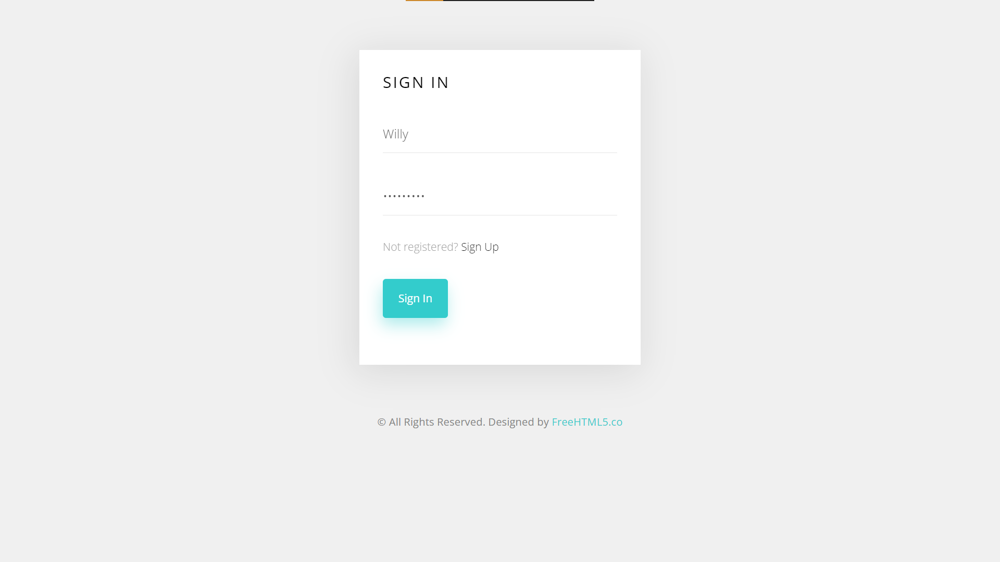
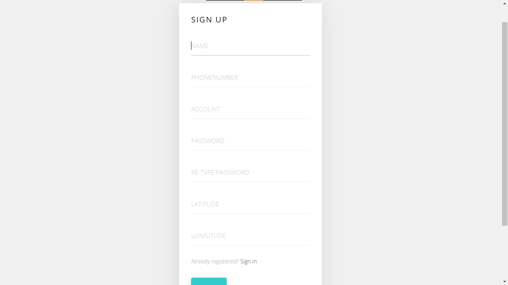
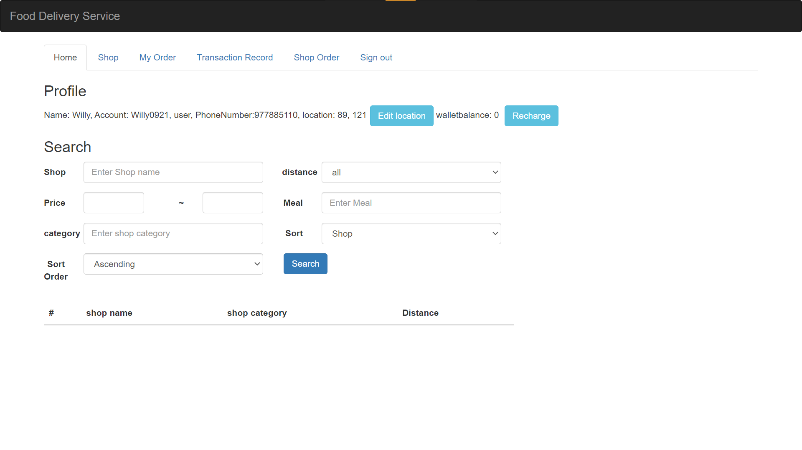
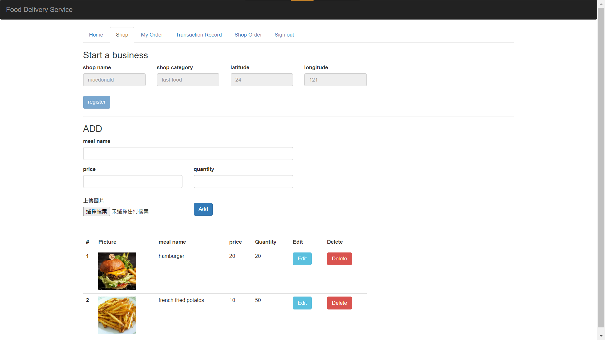
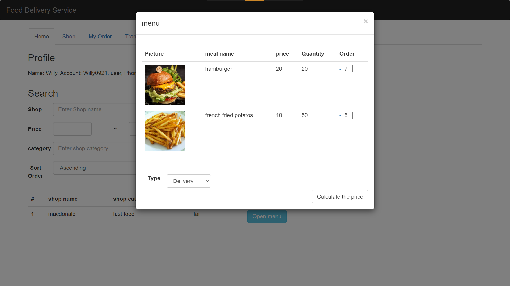
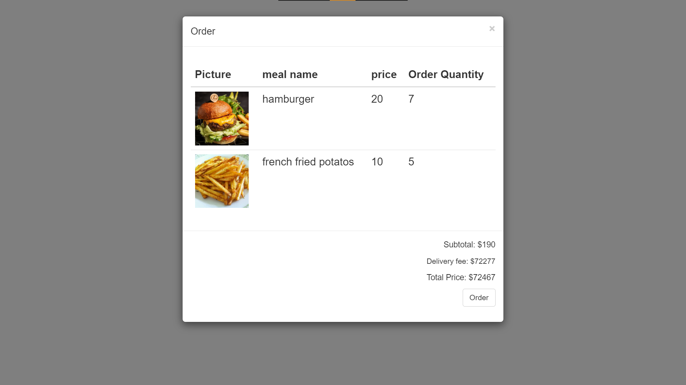
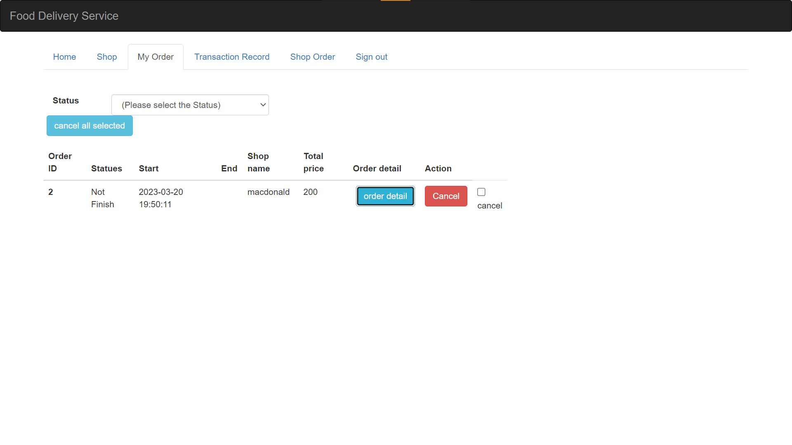
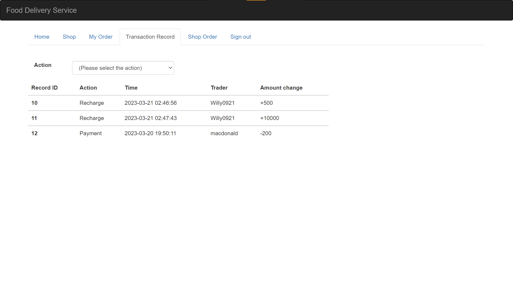

# delivery-site
1. Login page

2. Sign up page

3. Main muenu page

4. We can own our shop and add product we want

5. Order from main menu

6. Calculate the bill

7. we can check the status of our order

8. Transaction record page

